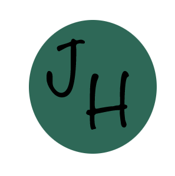

  

<h1 align="center">
  Jarrett Horton
</h1>
 

- 🔭 I’m currently working on creating useful projects to help abstract away annoying problems through code
- 🌱 I’m currently learning: DataSci, Microservices, Nifi
- 🤔 I’m looking for help with how not to be a noob at code
- 💬 Ask me about anything AWS
- 📫 How to reach me: jghorton14@protonmail.com
- ⚡ Fun fact: I dabble in woodworking and slacking off

